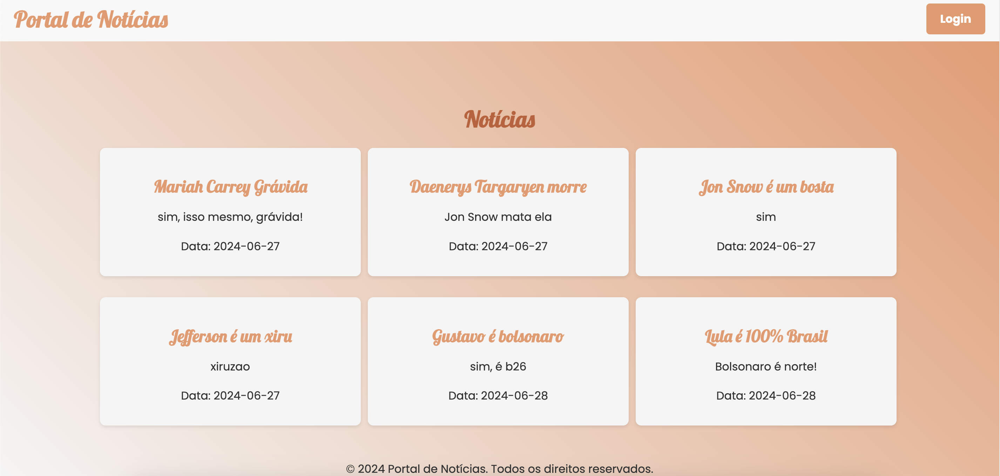
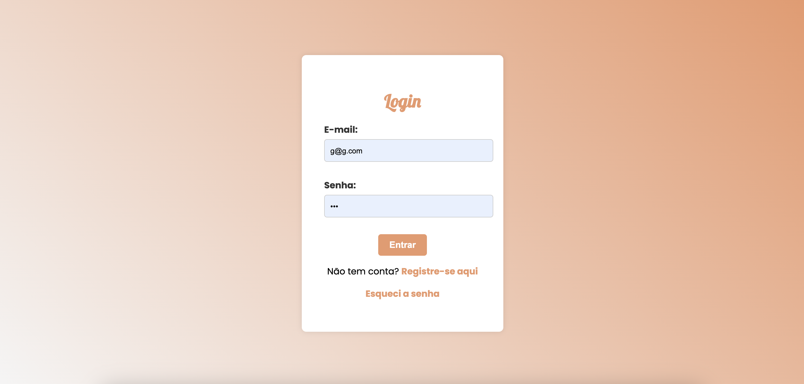
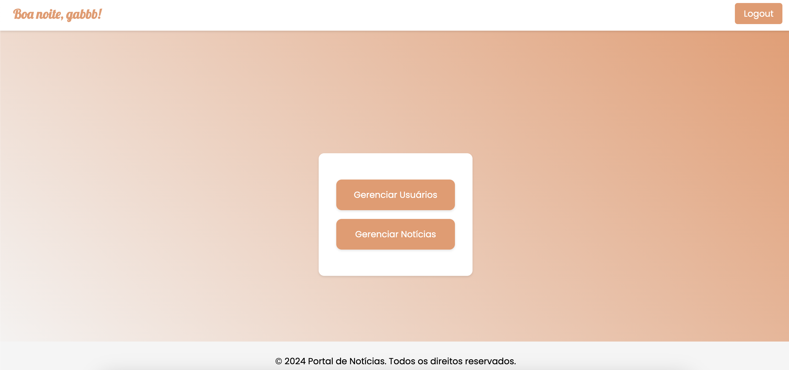
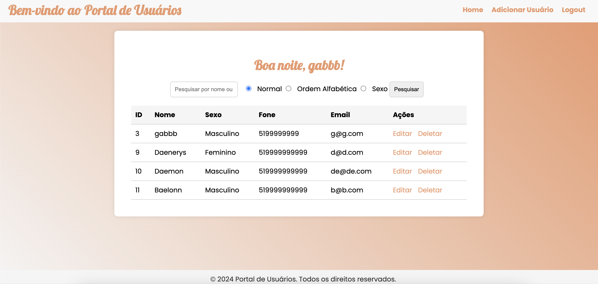
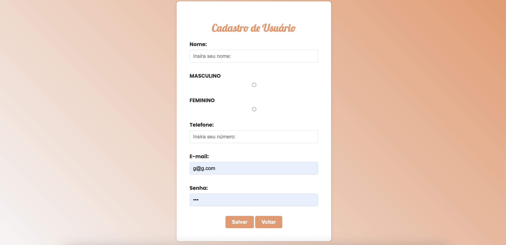
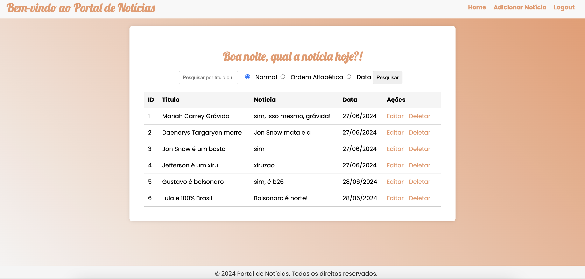
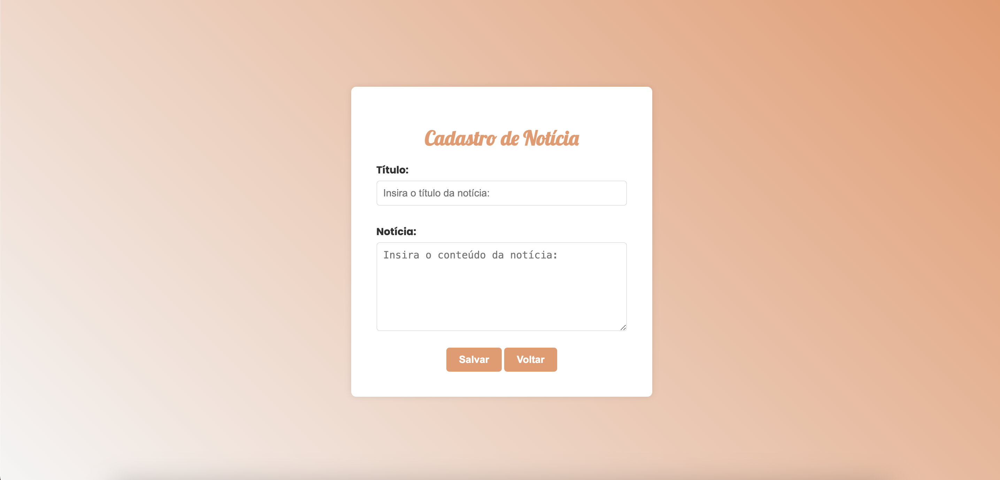

# Primeiro Projeto Crud.

Bem-vindo ao repositório do meu primeiro Projeto Crud, o projeto visa criar um site onde é possível verificar as notícias cadastradas, fazer login, cadastrar usuários, cadastrar notícias e, consequentemente, editá-los. O Projeto também é uma primeira tentativa de conectar o site, feito em PHP, com o banco de dados através do phpMyAdmin e Workbench.

## Conteúdo

- [Visão Geral](#visão-geral)
- [Estrutura do Projeto](#estrutura-do-projeto)
- [Como Usar](#como-usar)  
- [Características](#características)
- [Funcionalidades](#funcionalidades-principais)
- [Tecnologias Utilizadas](#tecnologias-utilizadas)
- [Realizador do Projeto](#realizador-do-projeto)
- [Contribuição](#contribuição)


## Visão Geral

O site, a principio feito para ser simples, é uma primeira tentativa de realizar o projeto e buscar alinhar as cores, design, funcionalidades, etc. Abaixo você pode verificar as primeiras aparências do mesmo:










## Estrutura do Projeto

- `index.php`: Página inicial do site.
- `css/`: Diretório contendo os arquivos CSS.
- `imagens/`: Diretório para armazenar imagens do site.
- `classes/`: Diretório contendo as classes de Database, Noticias e Usuários.
- `config/`: Diretório para conexão com o banco de dados.
- `header&footer/`: Diretório para armazenar as headers e footers do site.
  
## Como Usar

1. Clone o repositório:

   ```bash
   git clone https://github.com/Princeofskyy/ProjetoCrud.git

   
## Características

### Funcionalidades Principais:

- **Cadastro e Login de Usuários:** Sistema de autenticação para acesso ao portal.
- **Gerenciamento de Notícias:** CRUD para criação, leitura, atualização e deleção de notícias.
- **Conexão com Banco de Dados:** Integração com MySQL para armazenamento e recuperação de dados.

### Tecnologias Utilizadas:

- **PHP:** Linguagem de programação utilizada para o backend.
- **MySQL:** Banco de dados utilizado para armazenar informações.
- **HTML/CSS:** Estrutura e estilo da interface do usuário.

### Realizador do Projeto.

O projeto foi pensado e elaborado sozinho, conforme as atividades que o professor passou em aula, composto por:

- [**Gabriel Costa**](https://github.com/Princeofskyy)


### Contribuição

Contribuições são bem-vindas! Sinta-se à vontade para sugerir melhorias em design, funcionalidades e qualquer comentário referente ao site.

---

© 2024 Gabriel. Todos os direitos reservados.
